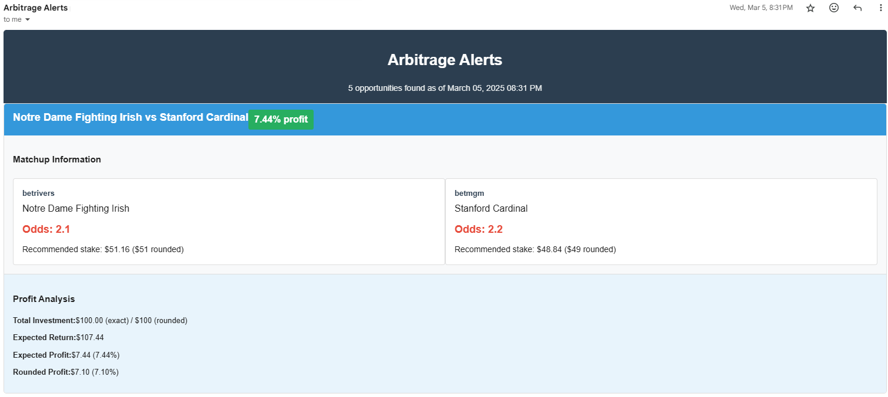

# ArbAlerts



A system to identify arbitrage opportunities in US sports betting markets and deliver alerts via email.

## Project Overview

ArbAlerts is an educational project that identifies arbitrage opportunities across multiple sportsbooks and delivers alerts to users. The goal was to build something that could actually be used while evaluating Claude 3.7 Sonnet and GPT-4o as design partners. Most of the code was written by me, with the models critiquing my design descisions and helping me iterate. The system scans betting markets, identifies favorable odds, and sends detailed email notifications. 

> **Note:** This is an educational project designed to demonstrate how arbitrage opportunities can be identified and monitored. It is not intended to encourage actual betting.

## Features

- **Arbitrage Detection**: Scan multiple sportsbooks to find profitable arbitrage opportunities
- **Email Alerts**: Send email notification with detailed information on the opportunity
- **Customizable Filters**: Configure minimum profit thresholds, sports, and leagues
- **Bet Optimization**: Calculates exact and rounded betting amounts to maximize profits
- **Scheduling**: Automate alerts on a schedule

## Future Development Plans

Once again, these aren't strictly for practical purposes, moreso to get hands on experience with the below in an end-to-end system.

- Web interface for viewing and managing alerts
- User management system with individual preferences
- Mobile notifications
- Cloud deployment

## Drawbacks

Ideally, an arbitrage system would consume events from a webhook to give realtime alerts. However, I'm not aware of a (relatively easy to use) webhook that exists to get sportsbook info. 

## Installation

### Prerequisites

- Python 3.8+
- A Mailgun account for email delivery

### Setup

1. Clone the repository:
   ```bash
   git clone https://github.com/yourusername/arbalerts.git
   cd arbalerts
   ```

2. Install dependencies:
   ```bash
   pip install -r requirements.txt
   ```

3. Set up environment variables:
   ```bash
   export MAILGUN_API_KEY='your_mailgun_api_key'
   export MAILGUN_DOMAIN='your_mailgun_domain.com'
   export API_KEY='the_odds_api_key' #https://the-odds-api.com/
   ```

4. Configure user preferences:
   ```bash
   cp config_example.json config.json
   # Edit config.json with your preferred settings
   ```

## Usage

### Running Manually

To run a one-time check for arbitrage opportunities:

```bash
python run.py
```

### Configuration Options

Edit the `config.json` file to customize your experience:

```json
{
  "default_user": {
    "email": "your@email.com",
    "schedule": "hourly",
    "min_profit_pct": 1.5,
    "sports": ["NBA", "MLB", "NFL"]
  }
}
```

## Disclaimer

This software is for educational purposes only. Sports betting may be illegal in your jurisdiction, and even where legal, carries significant financial risk. The authors of this software accept no liability for any financial losses incurred through the use of this software.
